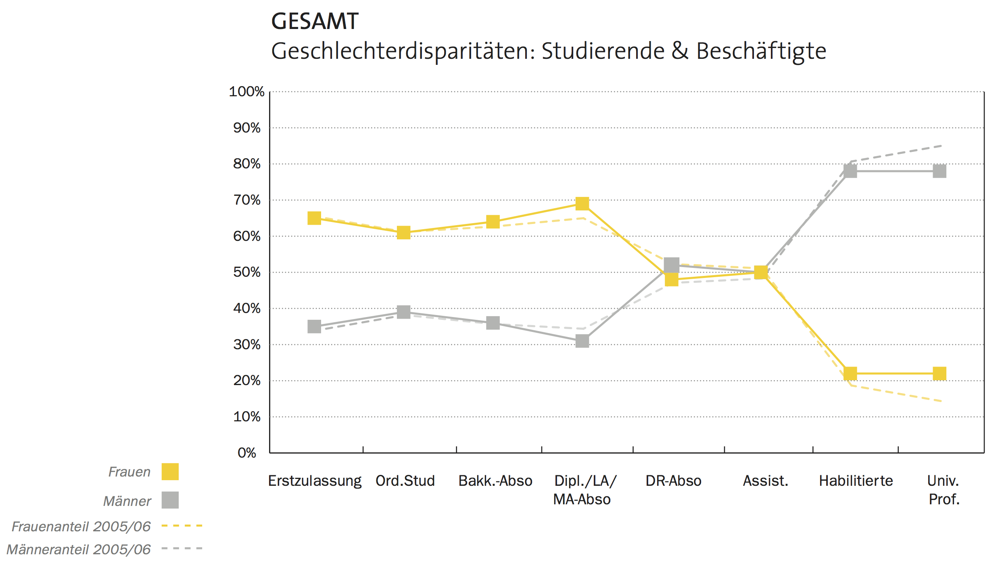

# Leaky Pipeline

--- 

----

## Historische Erklärung

------

## Familienplanung

## Weitere Gründe

# Studie

---

## Ablauf

## Tätigkeiten I

## Tätigkeiten II

# Reflexion

----

Thanks for the fish - irgendwas lustiges zum Abschluss

PHD-Comic zu Deadline oder Verschriftlichung?

<!-- To change keyboard bindings for remote presentation tool:
keyboard: {
    39: 'next',
    37: 'prev'
}
 -->
