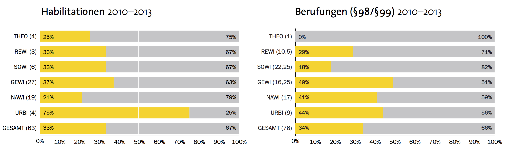

# Leaky Pipeline

--- 

## Generationeneffekte

------

## Karriereverläufe

## Forschungsstand

- *Illusio*
- Familienplanung
- Netzwerke
- Role-Models

# Ablauf der Studie

---

## Ablauf

- Quantitative Erhebung
    + Fragebogen
    + Dateneingabe
    + Auswertung
- Qualitative Erhebung
    + Leitfaden
    + Transkription
    + Auswertung
- Bericht

## Tätigkeiten

- Fragebogenerstellung
- Aufgabenteilung
- Faktorenanalysen und Grafiken
- Endbericht

# Ergebnisse

---

## Studienmotivation

## MentorInnen I

## MentorInnen II

> „Und ich glaube wenn ich nicht von ihr [Anm.: der Mentorin] zwischendurch so die massive Unterstützung gehabt hätte, hätte ich es vielleicht auch wieder verworfen.“ (*Etablierte Akteurin*)

## Role-Models

> „Es sollten halt keine extremen Vorbilder sein wo man sich denkt: Das will ich auf keinen Fall.“ (*Junge Nachwuchswissenschaftlerin*)

> „Ich merke an unserer Fakultät, zu mindestens, es tut gut, dass wir jetzt mehr Frauen berufen haben. Und vor allem auch Frauen, die selber erfolgreich gezeigt haben, dass Familie und Wissenschaft vereinbar ist.“ (*Etablierte Akteurin*)

## Entweder - Oder

> "Aber mir tut das eigentlich gut! Zu sehen dass eine junge Frau eine Chance hat und **trotzdem** zweifache Mutter ist." (*Doktorandin*)

> "Ich weiß, dass ich gewisse Preise nicht bereit bin zu zahlen, um in der Wissenschaft zu bleiben. [...] ich wäre auch nicht bereit **Familienplanung oder derartige Dinge aufzugeben um die große Karriere in der Wissenschaft zu starten** sozusagen." (*Doktorandin*)

# Reflexion

---

- Praktische Erfahrung
- Nähe und Distanz
- Wissenschaftliche Karriere?

----

## Danke für eure Aufmerksamkeit!

<!-- ](bb8.gif) -->

<!-- Thanks for the fish - irgendwas lustiges zum Abschluss

PHD-Comic zu Deadline oder Verschriftlichung? -->

<!-- To change keyboard bindings for remote presentation tool:
keyboard: {
    39: 'next',
    37: 'prev'
}
 -->
